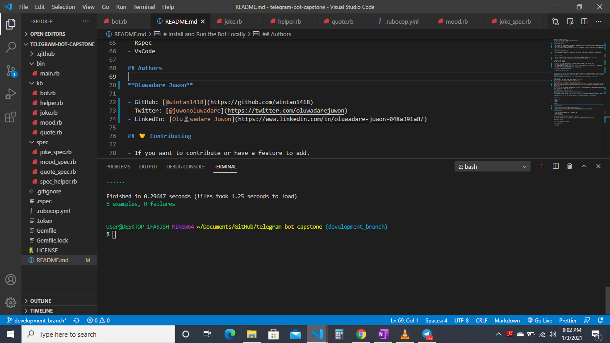
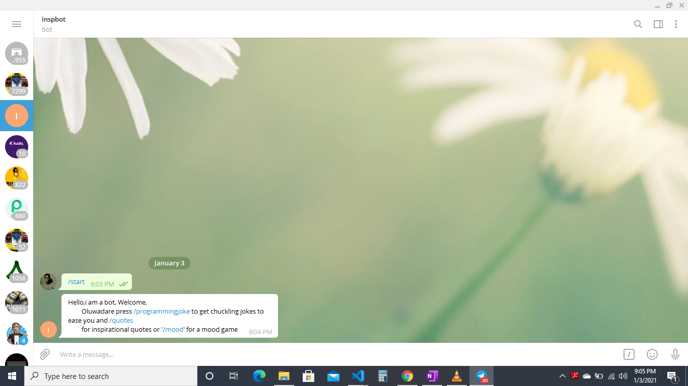

telegram-bot-capstone-project

Microverse Ruby Capstone Project

## Telegram Bot(Inspbot)

- This Telegram Bot has being built implementing  Ruby And [Telegram bot API](https://core.telegram.org/bots/api)
- simply search for 'Inspbot',  my Bot name.
- This bot behaves in accepting  commands and returning jokes,quotes or moods at random concerning programming.

# Rspec Tests

- you can locate my Rspec tests  in these files: joke_spec.rb, quotes_spec.rb, mood_spec.rb in spec folder.

# How to Run Tests

- You need to download Rspec Gem and install on your system using any code editor of your choice
- you can run tests by running rspec or rspec --format documentation command

# Commands to Run the Bot
This Bot has five commands

- [x] /start - It gives the instruction on  how to use othe commands to get the your info.
- [x] /quit  - persuades you not to quit".
- [x] /programmingjoke - It gives you a random selected programming joke related to any topic of programming.
- [x] /mood - gives a random mood emoji .
- [x] /quote - It gives a random quote related to programming.

# Install and Run the Bot Locally

In order to run the Bot, you need to install RUBY in your computer. For windows you can go to [Ruby installer](https://rubyinstaller.org/) and for MAC and LINUX you can go to [Ruby official site](https://www.ruby-lang.org/en/downloads/) for intructions on how to intall it.

## When you have Ruby Installed in your System, please follow bellow mentioned steps to run the Bot

**Step 1** 
Clone the repo in your local folder where you want to run it 
`https://github.com/wintan1418/telegram-bot-capstone`. 
**Step 2** 
Run `bundle install` to install the gems from the `Gemfile`. 
**Step 3** 
Download the [Telegram app](https://desktop.telegram.org/) if you dont have, create an account and talk to the [Botfather](https://t.me/botfather). Follow the instructions and create a bot, you will then receive an API Token  and the link to your bot. 
**Step 4** 
Run `touch .env` on your terminal to create the `.env` file in root of the directory. Then add your token in the required field `TELEGRAM_KEY=` inside the file. 
**Step 5** 
Run `ruby bin/main.rb` to start the bot. 
**Step 6** 
Open the link to the bot that you received from the Botfather. 
**Step 7** 
You can use the commands defined in the [Available commands section](#Commands-to-Run-the-Bot) defined above. 

## This Bot is Live Now. You can click [Here](https://http://t.me/Juthybot) to Play with Bot

## Built With

- Ruby
- Telegram API
- Rspec
- VsCode

## Authors

**Oluwadare Juwon**

- GitHub: [@wintan1418](https://github.com/wintan1418)
- Twitter: [@juwonoluwadare](https://twitter.com/oluwadarejuwon)
- LinkedIn: [Oluwadare Juwon](https://www.linkedin.com/in/oluwadare-juwon-048a391a8/)

## 🤝 Contributing

- If you want to contribute or have a feature to add.
- Go to the repo
- Open a pull request

Contributions, issues and feature requests are welcome!

Feel free to check the [issues page](https://github.com/SajjadAhmad14/Telegram-bot/issues).

## Show your support

Give a ⭐️ if you like this project!

## Acknowledgments

- Microverse
